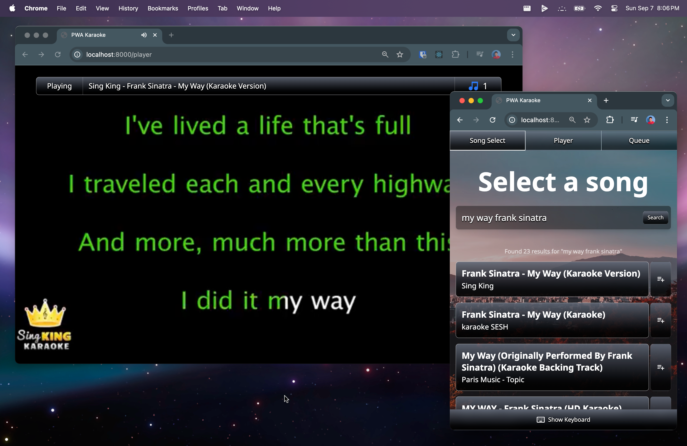

# PWA Karaoke

A web-based karaoke application that transforms any device into a karaoke system.

> [!IMPORTANT]
> This software is intended for personal, non-commercial use only. Users are responsible for ensuring compliance with applicable copyright laws and terms of service in their jurisdiction.**



*My Way, Philippines' most deadly karaoke song, playing in PWA Karaoke.*

## Features
- Use your phone or tablet as a controller and any web-capable device as a display
- Easy to use and slick user interface
- Search and queue songs video streaming platforms
- Supports multiple rooms with password protection
- Operate entirely within the browser

## Downloads
### Releases
Coming soon. In the meantime, you may use the "Clone with Git" or "Download ZIP" methods below.

### Clone with Git
To download the application via `git`, simply clone it using `git clone https://github.com/username/pwa-karaoke.git`.

### Download ZIP
You can download the source code as a ZIP file by clicking "Code" → "Download ZIP" on the GitHub repository page.

## System Requirements
- Minimum 2GB RAM, 1 vCPU
- Docker (if using Docker or Docker Compose)

See the [manual setup prerequisites](#prerequisites) when running without Docker.

## Setup
### Docker Compose
The recommended way to run PWA Karaoke is through Docker Compose. This method simplifies the setup process and ensures that all dependencies are correctly configured.

```bash
docker-compose up -d
```

This will start the backend and [Caddy](https://caddyserver.com/) web server.

Visit `http://localhost` or `http://$DOMAIN` (where `$DOMAIN` is your configured domain) to access the application.

### Docker

If you have a custom setup that doesn't use Docker Compose, you can run the backend and frontend services separately using Docker.

```bash
# Build the application
docker build -t pwa-karaoke .

# Run the container
docker run -d -p 8000:8000 --name pwa-karaoke pwa-karaoke
```

Visit `http://localhost:8000` to access the application.

### Manual
A manual setup is also possible. This method requires more steps but allows for greater customization.

#### Prerequisites
Ensure you have the following installed:
- Python 3.11+
- Node.js 20+
- Docker (optional, for containerized deployment)

#### Steps
To set up PWA Karaoke manually, follow the setup procedure below:

```bash
# Build frontend and bundle into backend
cd frontend
npm install
npm run build:prod

# Start the server
cd ../backend
pip install -r requirements.txt
python main.py
```

Visit `http://localhost:8000` to access the application.

## Usage

### Rooms
After starting the server, you will be prompted to **create** or **join** a room. Rooms allows multiple groups to create karaoke sessions independently.

#### Joining a Room
You can either browse our list of publically available rooms or enter a room ID to join a private room.

#### Creating a Room
> [!TIP]
> You can also add passwords to public rooms to restrict access while still being listed.

When asked, you will be prompted with the following details:
- **Room ID**: You will be provided with a randomly generated room ID or you can set your own.
- **Room Visibility**: You can choose to make your room be shown **in public listings** or be **private**.
- **Room Password**: Optionally, you can set a password for your room to restrict access.

### Modes

Once you create or join a room, you are prompted to enter the room in two modes:
- **Display Mode:** For TVs, projectors, or multiple screens to show the video playback and song queue. It supports playing to multiple displays in near real-time.
- **Controller Mode:** For phones or tablets to search for songs and control playback.

### Development

To contribute to PWA Karaoke, fork the repository and create a new branch for your changes. See the individual README files in the `backend/` and `frontend/` directories for setup instructions. After making your changes, submit a pull request with a clear description of what you've modified.

## License

This project is licensed under the MIT License - see the [LICENSE](LICENSE) file for details.

---

**Disclaimer:** This software is provided "as is" without warranty of any kind. Use at your own risk and ensure compliance with all applicable laws and terms of service.

© 2025 Ned Palacios
